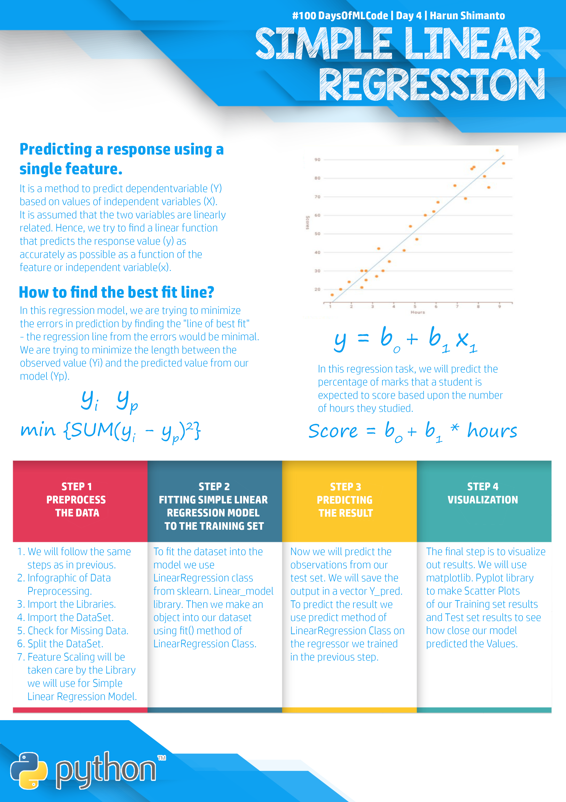
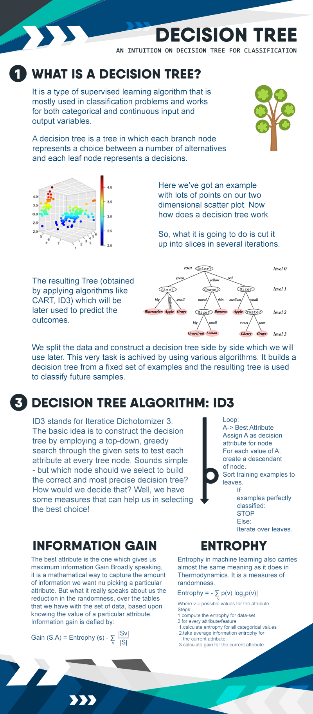

# 100 Days Of ML Code

 

:point_up: This Banner Design by my buddy [Sheikh Anikul Islam Hani](https://github.com/SheikhAnikulIslam):octocat:.He is awesome person.:ok_hand: :bust_in_silhouette:

The creation of this repository was inspired by [Siraj Raval's challenge](https://www.linkedin.com/feed/update/urn:li:activity:6420525903968825344/) to code machine learning for at least an hour everyday for 100 days.
I nervously accepted this challenge in addition to working full time in the 2018 summer semester. I will use this repository to store code, jupyter notebook examples, and thought processes.

You can follow me on [@Medium](https://medium.com/@harunshimanto)for interesting blog articles.
## Day 0 : Aug 5 to 6 , 2018 | Challenge Starting peparation 

**Today's Progress** : I have setup all the things I needed to complete this challenge and also completed chosing the projects I will work on .

**Thoughts** : Hope this will be exiciting ,will help me in learning Machine Learning in a more effective way .

## Day 1 : Aug 7 , 2018 | [Crash course of Data Science and ML with Python](https://www.linkedin.com/feed/update/urn:li:activity:6432532718810169344/)

**Today's Progress** : I have completed article and code for Crash course of Data Science and ML with Python.

**Thoughts** : It is challenging for Beginners.But i will try easily explain of all things for Crash course of Data Science and ML with Python.

**Link of Work**: [Article](https://hackernoon.com/10-ways-to-make-python-a-dangerous-language-for-data-science-6b88566ac040) => [code](http://bit.ly/2KC7EvY)
 
## Day 2 : Aug 8 , 2018 | [Exploratory Data Analysis(EDA)](https://www.linkedin.com/feed/update/urn:li:activity:6432869901274312704)

**Today's Progress** : Today I've spent many hours exploring Exploratory data analysis.It plays a role in the work of data science and machine learning.

**Thoughts** : I am giving a brief intro of Exploratory data analysis(EDA) in Python with help of pandas and matplotlib.And I am using a dataset on Super Store's for this.

**Link of Work**: [Article](https://hackernoon.com/overview-of-exploratory-data-analysis-with-python-6213e105b00b) => [code](http://bit.ly/2KytuAo)

## Day 3 : Aug 9 , 2018 | [Data PreProcessing](https://www.linkedin.com/feed/update/urn:li:activity:6433216669149159424)

**Today's Progress** : Today I've spent many hours exploring Data Preprocessing.Check Out :point_up: this Amazing Infographic I made which gives a complete step by step guide to data preprocessing.

**Link of Work**: [Article](https://medium.com/datadriveninvestor/data-preprocessing-for-machine-learning-188e9eef1d2c) => [Code](http://bit.ly/2KDkTfT)

## Day 4 : Aug 12 , 2018 | [Simple Linear Regression](https://www.linkedin.com/feed/update/urn:li:activity:6434122254916902912)

**Today's Progress** : Today I've spent many hours exploring on Simple Linear Regression, check it out. I think infographics are a worthy replacement of lengthy articles on these topics. 

**Link of Work**: [Article](http://bit.ly/2MbIzO4) => [Code](http://bit.ly/2MjvQrS)

## Day 5 : Sep 29 , 2018 | [Decision Trees](https://www.linkedin.com/feed/update/urn:li:activity:6451684610320502784)

**Today's Progress** : Today I've spent many hours exploring on Decision tree classification algorithm. I think infographics are a worthy replacement of lengthy articles on these topics. 

**Link of Work**: [Article](https://bit.ly/2jnSH5w) => [code](https://bit.ly/2xLec7M)

## Day 6 : Jan 2 , 2019 | [Summarization With Wine Reviews Using spaCy](https://twitter.com/Shimanto47/status/1080707882197278722)

**Today's Progress** : Today I've spent many hours exploring on Text summarization on NLP.

**Link of Work**: [Article](https://goo.gl/Gr7kcG) => [code](https://goo.gl/rZatDk)

# Contributing

